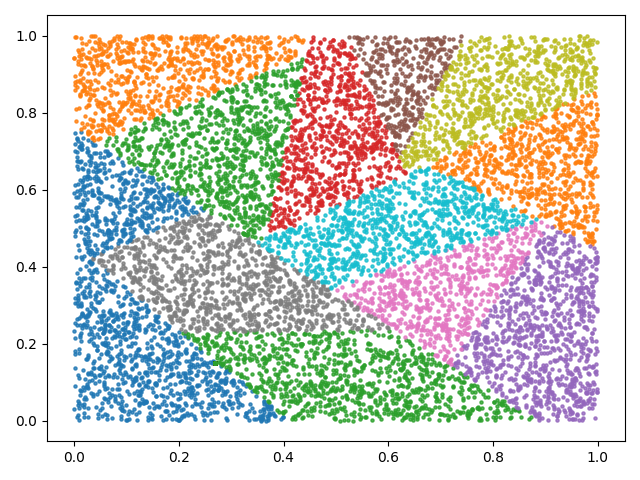

# GPU Random Sample Forest KNN (RSFK)

This project presents a CUDA implementation of the Random Sample Forest KNN (RSFK) algorithm.

# Citation

Please cite the corresponding paper if it was useful for your research:

```
@article{10.1145/3447779,
author = {Meyer, Bruno Henrique and Pozo, Aurora Trinidad Ramirez and Zola, Wagner M. Nunan},
title = {Improving Barnes-Hut t-SNE Algorithm&nbsp;in Modern GPU Architectures with Random Forest KNN and Simulated Wide-Warp},
year = {2021},
issue_date = {October 2021},
publisher = {Association for Computing Machinery},
address = {New York, NY, USA},
volume = {17},
number = {4},
issn = {1550-4832},
url = {https://doi.org/10.1145/3447779},
doi = {10.1145/3447779},
abstract = {The t-Distributed Stochastic Neighbor Embedding (t-SNE) is a widely used technique for dimensionality reduction but is limited by its scalability when applied to large datasets. Recently, BH-tSNE was proposed; this is a successful approximation that transforms a step of the original algorithm into an N-Body simulation problem that can be solved by a modified Barnes-Hut algorithm. However, this improvement still has limitations to process large data volumes (millions of records). Late studies, such as t-SNE-CUDA, have used GPUs to implement highly parallel BH-tSNE. In this research we have developed a new GPU BH-tSNE implementation that produces the embedding of multidimensional data points into three-dimensional space. We examine scalability issues in two of the most expensive steps of GPU BH-tSNE by using efficient memory access strategies , recent acceleration techniques , and a new approach to compute the KNN graph structure used in BH-tSNE with GPU. Our design allows up to 460\% faster execution when compared to the t-SNE-CUDA implementation. Although our SIMD acceleration techniques were used in a modern GPU setup, we have also verified a potential for applications in the context of multi-core processors.},
journal = {J. Emerg. Technol. Comput. Syst.},
month = {jun},
articleno = {53},
numpages = {26},
keywords = {t-Distributed Stochastic Neighbor Embedding, K-Nearest Neighbors, Random Forest, KNN, t-SNE, Barnes-Hut, GPU}
}
```

## K-NNG
The K-Nearest Neighbor Graph is a problem that consists in: For each element of a set V, find the K most similar objects (neighbors) to each object that also is contained in V.
The NN-Descent algorithm [[1]](#references) is an algorithm that computes an approximation of K-NNG using MapReduce primitives.

In this project, we provide an implementation of RSFK algorithm in CUDA language with a python interface. RSFK uses a very similar strategy to [LarveVis](https://github.com/lferry007/LargeVis) [[3]](#references) algorithm, where randomized trees generate different partitions. These partitions are used to explore real neighbors for every point. Also, a neighborhood exploration method is used to improve the quality of the K-NNG approximation.


## Compiling and Installing
```bash
make && sudo make install # Generic compilation and global install
make && make install SETUP_FLAG="--user" # Generic compilation and local install
make python_arch75 && make install SETUP_FLAG="--user" # Compilation for a specific NVIDIA architecture and local install
```

## Run (Python)
### Constructions K-Nearest Neighbor Graph
```python
import numpy as np
from gpu_rsfk.RSFK import RSFK
points = np.random.random((1000000,100))
K = 32 # number of neighbors
rsfk = RSFK(random_state=0)
indices, dist = rsfk.find_nearest_neighbors(points,
                                            K,
                                            verbose=1,
                                            n_trees=50) # number of trees
print(indices) # the neighborhood of each point
print(dist) # the squared distance to each neighbor
```

```python
[[     0  31675 681056 ...  76565 215445 466714]
 [     1 788655 291762 ... 518101 372516 261391]
 [     2 569866 858381 ... 960535 794887 159680]
 ...
 [999997 625514 233354 ... 217298 568597 805424]
 [999998 588030 796374 ... 611888 321668 748140]
 [999999  63518 387808 ...  18947 277399 995385]]
[[ 0.         9.997955  10.742531  ... 11.311033  10.854658  10.957819 ]
 [ 0.        11.359983  11.517796  ... 10.417099  11.3883095 11.174629 ]
 [ 0.        11.319759  11.306412  ... 11.440113  11.263405   9.516406 ]
 ...
 [ 0.        11.373617   9.993327  ... 10.597631  11.374975  10.346858 ]
 [ 0.        10.520063  10.235972  ...  9.641689  10.381821   9.694969 ]
 [ 0.        11.417332  11.84985   ... 11.933416  10.799774  11.2241   ]]
```

### Construction a partition with a Random Sample Tree
The following code contains an example of how to build a partition of a set of points from a Random Sample Tree.
Also, the file [``examples/cluster_with_forest.py``](https://github.com/BrunoMeyer/gpu-rsfk/blob/master/examples/cluster_with_forest.py) contains the code to create [figures from the result](#random-sample-forest-knn).

```python
import numpy as np
from gpu_rsfk.RSFK import RSFK
points = np.random.random((10000,2))
rsfk = RSFK(random_state=0)
result = rsfk.cluster_by_sample_tree(points,
                                     min_tree_children=256,
                                     max_tree_children=1024,
                                     verbose=1)
total_leaves, max_child, nodes_buckets, bucket_sizes = result
print(total_leaves) # total of buckets
print(max_child) # maximum size of a bucket
print(nodes_buckets) # the partition of points serialized in one vector
print(bucket_sizes) # the size of each subset (bucket) on the partition
```

```python
Creating cluster with forest takes 0.109001 seconds
16
819
[1255 1262 1265 ...   -1   -1   -1]
[819 469 657 269 642 420 435 762 749 780 665 520 816 425 806 766]

```


## Random Sample Forest KNN


The RSFK algorithm presented in this project consists in combining the result of different "weak" approximations like the Random Projection Forest KNN algorithm [[2]](#references). Also, RSFK uses a very similar strategy like that described in [LarveVis](https://github.com/lferry007/LargeVis) paper [[3]](#references), where the [ANNOY](https://github.com/spotify/annoy) project is used to construct the K-NNG.

The Random Projection Forest KNN creates different trees. Each tree creates a partition of the set of points with *D* dimensions, dividing the points in different subsets. Each point considers all other points that are in its subset as potential neighbors. This limitation of exploration reduces the quadratic computational time complexity of the exact algorithm, leading to an approximation that is sufficient when several trees are created. Each tree is created as follow:


- Create a random direction in the D-dimensional space;

- Project each point of the set in the random direction;

- Split the set into two new subsets considering the median projection values;

- Repeat the process for each subset until the subset size reaches a threshold.
 
The main difference between Random Projection Forests and RSFK lies in the fact that the trees do not project the points into a random projection. Instead, RSFK only samples two random points, generates a hyperplane equally distant to those points, and creates the two subsets based in the side that each point is in the hyperplane. This process allows an implementation that demands less computational overhead, reducing the computational time and the simplification of the parallelization.

### Nearest Neighbor Exploration
Like [LarveVis](https://github.com/lferry007/LargeVis) [[3]](#references), we also present a post-processing technique that explore the neighbors of neighbors.
This exploration can be executed many times and is controlled by the parameter ``nn_exploring_factor``.

## Similarity Search

Another option to create the K-NNG from a set of points is to use algorithms that compute the generic similarity search considering a set base of points and a set of query points.
An approximation can be created using approximations of KNN like [FAISS library](https://github.com/facebookresearch/faiss).


The following code is an example of the usage of FAISS with GPU.

```python
import faiss
import numpy as np

points = np.random.random((1000000,100))
K = 32

res = faiss.StandardGpuResources()  # use a single GPU
# Set the base and query points as the same 
xb = np.require(points, np.float32, ['CONTIGUOUS', 'ALIGNED'])
xq = np.require(points, np.float32, ['CONTIGUOUS', 'ALIGNED'])
nq, d = xq.shape

# Parameters that control the trade-off between Quality and Time  
nlist = int(np.sqrt(1000000))
nprobe = 20

quantizer = faiss.IndexFlatL2(d)
index = faiss.IndexIVFFlat(quantizer, d, nlist, faiss.METRIC_L2)
index.nprobe = nprobe

index.train(xb)
index.add(xb)
index = faiss.index_cpu_to_gpu(res, 0, index)

indices, dist = index.search(xq, K)     # actual search

print(indices)
print(dist)
```

# References

[1] Dong, W., Moses, C. and Li, K., 2011, March. Efficient k-nearest neighbor graph construction for generic similarity measures. In Proceedings of the 20th international conference on World wide web (pp. 577-586).

[2] Yan, D., Wang, Y., Wang, J., Wang, H. and Li, Z., 2019. K-nearest Neighbors Search by Random Projection Forests. IEEE Transactions on Big Data.

[3] Tang, J., Liu, J., Zhang, M. and Mei, Q., 2016, April. Visualizing large-scale and high-dimensional data. In Proceedings of the 25th international conference on world wide web (pp. 287-297).
